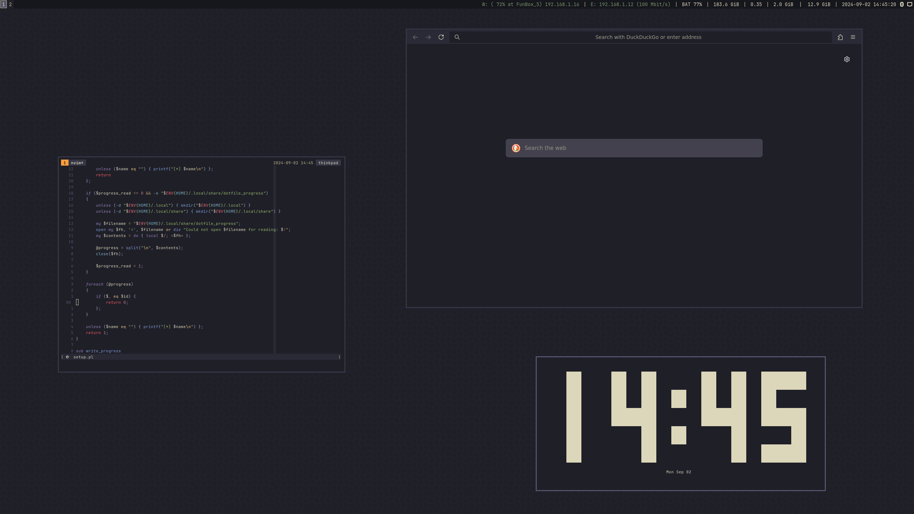

# My configuration files



## Installation

> [!WARNING]
> This install script is designed to work on Debian 12 bookworm. If you want to install this setup on other Linux distributions/OSes, you will need to create a new target file for your OS.

Clone the repository and run the setup.pl file

```
./setup.pl
```

> [!NOTE]
> You might want to modify the [target file](targets/debian.pl) to change which software to install

## License

All files in this repository are licensed under the [MIT-0](LICENSE) license unless stated otherwise.

## Special thanks

* https://gitlab.com/Nmoleo/i3-volume-brightness-indicator
* https://github.com/rebelot/kanagawa.nvim
* https://github.com/ThePrimeagen/init.lua
* https://github.com/Tibor5/minim_lualine
* https://github.com/ttntm/cmus-kanagawa
